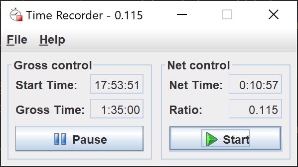

# Time Recorder

[+] Feature added.\
[-] Feature removed.\
[*] Improved.\
[#] Bug fixed.

#### Version 1.41
[*] Multi-monitor support.

#### Version 1.4
[+] Start/stop gross timer.\
[+] Add 'New Workday' feature.\
[+] 'About' dialog.\
[+] Ratio showing in window and tray title.\
[-] Remove 'Exit' item from the tray.
                                                           
#### Version 1.2
[+] Added tray folding support.

#### Version 1.1
[+] Restore running timers' data while the program restarting.\
[#] Net ratio updates even if net clock stopped but gross clock running.\
[*] Loading icons only once while application start.

#### Version 1.0
[+] The project was added to Google Code site.
